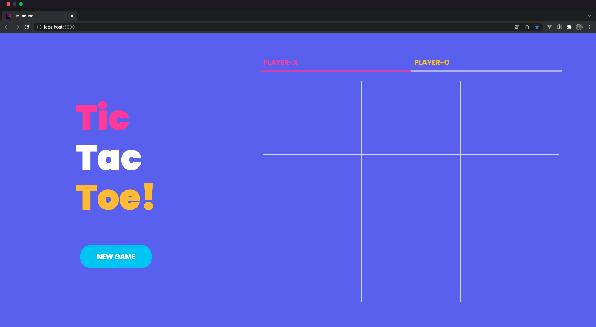
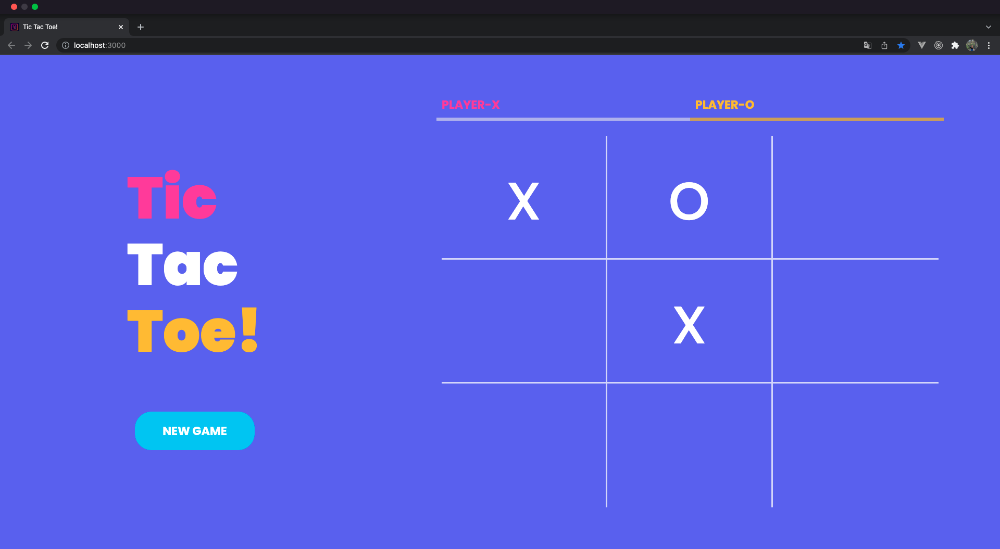
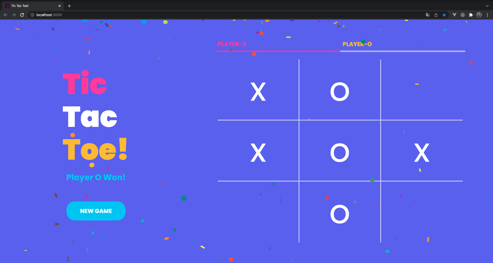
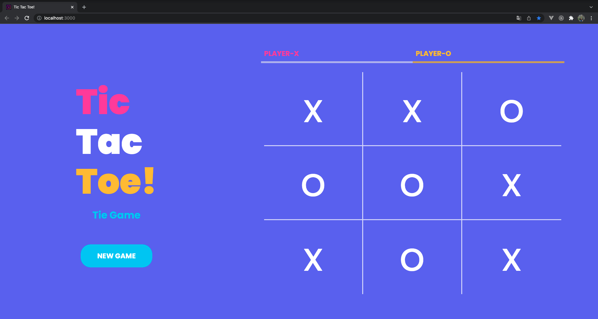

# Tic Tac Toe Game With ReactJS 😵👾

## Demo Website

### 👉🏻 https://esrasen9.github.io/tic-tac-toe

## Installation ⚡

<ul>

<li> 

npm

<pre>
<code>npm install npm@latest -g
</code></pre>
    </li>
    <li>

Clone the repo

<pre>
<code>git clone https://github.com/esrasen9/tic-tac-toe</code>
</pre>
<li>

Install npm packages

<pre>
<code>npm install</code>
</pre>
</li>
 
</ul>

## Screenshots :camera_flash:

